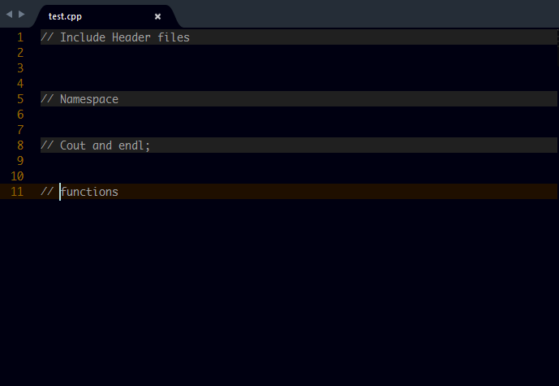

# C++ Completions

## About
This Sublime Text (2 or 3) package gives method completion suggestions for C++.

## Screenshot


## How to Use

### Methods and other completions

Just type the words and the completion suggestions should show up. Press `ENTER` or `TAB` for completion.

#### Including header files
Type **i-**`header name` then Press `ENTER` or `TAB` for completion. e.g.

> i-vector to get:

```c
  #include <vector>
```

> **Note:** For best result, you can disable `Qt Completions for C++` **(if installed)** so that only the normal C++ methods would show up in the completion lists.


## Contributing

All contributions are welcome. Just fork it on [Github](https://github.com/tushortz/CPP-Completions) and create a pull request.

## License

© 2015 Taiwo Kareem | taiwo.kareem36@gmail.com.

**Read license.txt**